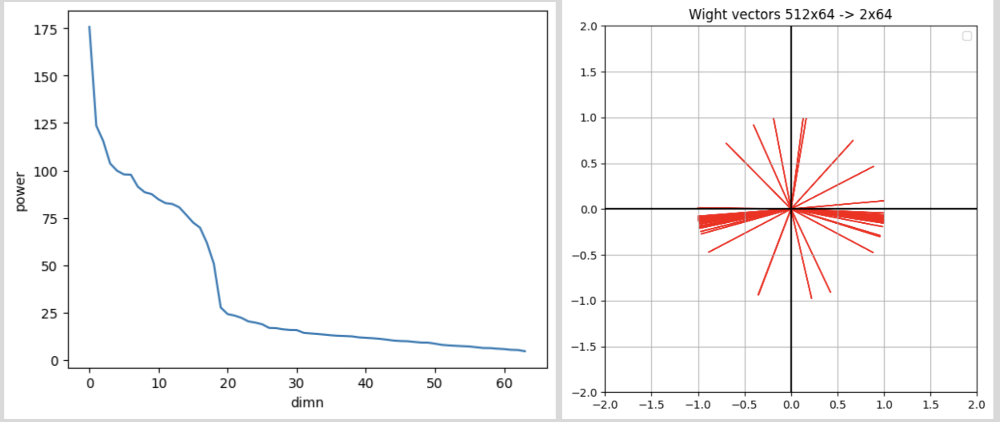

# ssl-0
Look what SSL Thinks

## Visualizations

### Neuron Activations

The images `assets/last.png` and `assets/conv-next.png` show the neuron activations from different layers of the network.

-   **Y-axis:** Samples
-   **X-axis:** Feature Index
-   **Color:**
    -   Whiter: Activation is distant from 0
    -   Black: Activation is 0

### Weight Matrix Analysis

The images `assets/power1.png`, `assets/power2.png`, and `assets/power3.png` show the analysis of the weight matrices in the last dense layers.

-   **Left:** Power spectrum after singular value decomposition of the weight matrix.
-   **Right:** 2D PCA of the weight axes.

Condensed and polarized weight vectors can indicate dimensional collapse, resulting in low-rank weight matrices.

## Notebooks

For a detailed walkthrough of the code and experiments, please see the Jupyter notebooks in the `notebooks/` directory.

## Status

Refactored codes are in progress.